# Active Directory Lab Project — Fagan Systems      
This project simulates the planning, setup, and administration of a professional Active Directory (AD) environment for a fictional IT consulting company called **Fagan Systems**. It demonstrates core skills in systems administration, domain configuration, organizational unit (OU) design, user and group management, and access control via Group Policy.

This lab environment was created as a portfolio piece to showcase technical skills relevant to roles in systems administration, IT support, and network infrastructure.

## Table of Contents
- [Objectives](#objectives)
- [Lessons Learned & Skills Demonstrated](#lessons-learned--skills-demonstrated)
- [Technologies Used](#technologies-used)
- [Project Goals](#project-goals)
- [Domain Setup](#domain-setup)
- [Windows 10 Client Setup](#windows-10-client-setup)
- [Print Server Setup](#print-server-setup)
- [Organizational Unit (OU) Structure](#organizational-unit-ou-structure)
- [Users](#users)
- [Security Groups](#security-groups)
- [Access Control and Shared Folders](#access-control-and-shared-folders)
- [Group Policy Objects](#group-policy-objects-gpo)
- [About Fagan Systems (Fictional Company)](#about-fagan-systems-fictional-company)

## Objectives

- Design and implement a fully functional Active Directory domain environment.
- Build a logical and scalable Organizational Unit (OU) structure to reflect business needs.
- Create and manage user accounts, computers, and security groups.
- Join Windows clients to the domain and assign appropriate access.
- Apply Group Policy Objects (GPOs) to enforce settings and standardize configurations across the domain.

## Lessons Learned & Skills Demonstrated

- Designed and deployed a professional Active Directory domain
- Created and applied a structured, business-aligned OU hierarchy
- Managed domain users, workstations, and security groups
- Configured file share and printer access with permission-based controls
- Successfully joined client machines to the domain
- Applied and verified Group Policy Objects (GPOs) for system behavior, security settings, and user restrictions
- Implemented mapped network drives and default printers through GPO
- Used tools like `gpresult`, `RSOP.msc`, and Event Viewer for troubleshooting  

## Technologies Used

- Windows Server 2022 (Domain Controller)
- Windows 10 / 11 (Client Machines)
- Active Directory Domain Services (AD DS)
- Group Policy Management Console (GPMC)
- DNS and DHCP services (simulated lab environment)
- PowerShell and Command Prompt for administrative tasks

## Project Goals

This project was created to:

- Strengthen hands-on experience with enterprise-grade IT infrastructure
- Practice administering and troubleshooting Windows-based networks
- Demonstrate readiness for roles in IT support, help desk, or systems administration
- Serve as a strong portfolio project for job interviews and internships

## About Fagan Systems (Fictional Company)

Fagan Systems is a mid-sized IT consulting firm with several internal departments such as IT Support, HR, Sales, and Finance. The Active Directory environment reflects this organizational structure and supports centralized management of users, devices, and resources across a simulated domain: `fagan.local`.     

## Domain Setup      
**Domain Name:** `fagan.local`  
**Domain Controller:** `DC01`  
**Operating System:** Windows Server 2022 (Standard Evaluation)  
**IP Address:** `192.168.50.10` (Static)  
**Functional Level:** Windows Server 2016  

**Roles & Features Installed:**
- Active Directory Domain Services (AD DS)
- DNS Server
- Remote Desktop Services (enabled)

**Domain Promotion:**  
- Domain promoted using Server Manager  
- AD DS and DNS installed prior to promotion

## Windows 10 Client Setup

**Client Name:** `DESKTOP-1`  
**Operating System:** Windows 10 Pro  
**IP Address:** `192.168.50.11`  
**DNS Server:** `192.168.50.10` (DC01)  
**Joined Domain:** `fagan.local`

**Login Test:**  
- Successfully logged into domain using:  
  `FAGAN\mtaylor`  
- Verified correct access based on group membership and applied Group Policy Objects

## Print Server Setup
### Why I Used a Dedicated Print Server

The first decision I had to make was whether to use my domain controller (DC01) as the print server or to create a dedicated one. While using the domain controller might work in a small lab, I chose to set up a **dedicated print server** for the following reasons:

- **Domain controllers should only run domain services.** Mixing in printing services adds unnecessary complexity and risk in a real-world setup.
- **Security matters.** I didn’t want to expose my domain controller to the risks associated with print services.
- **Resiliency.** If the print server crashes, I don’t want it to interfere with logins, DNS, or GPOs.
- **Best practice.** Keeping roles separate is a clean and professional approach, even in a lab.

### Creating the Dedicated Print Server

I created a new virtual machine called `PrintSrv01` using minimal resources:

- **Startup memory:** 1024 MB (1 GB), dynamic
- **Hard disk:** 60 GB
- **Connected to:** `EmiLabSwitch`
- **OS:** Windows Server 2022 (Standard Evaluation, Desktop Experience)

After the OS was installed:
- I set the local administrator password
- Renamed the machine to `PrintSrv01` (important to do before joining a domain)

### Network Configuration

- Opened **Network and Internet Settings**
- Went to Ethernet > Properties > Internet Protocol Version 4 (TCP/IPv4)
- Selected “Use the following IP address” and set a static IP
- **Joined the domain:** `fagan.local`
  - Used **System Properties** to switch from `WORKGROUP` to domain
  - Made sure DC01 was online so the join process could complete

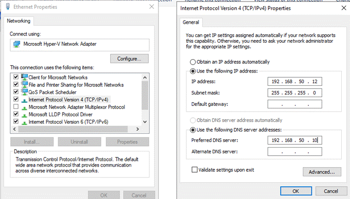
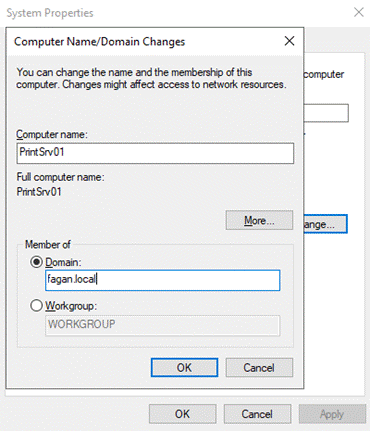

### Installing Print Services

Logged in with a **domain user with administrator rights**, and then:

1. Opened **Server Manager**
2. Went to **Manage > Add Roles and Features**
3. Installed the **Print and Document Services** role
4. Selected **Print Server** under role services

### Creating and Sharing the Printer

After the Print Server role was installed:

1. Opened **Print Management** (`Windows + R > printmanagement.msc`)
2. Went to:  
   `Print Servers > PrintSrv01 > Printers`  
3. Right-clicked **Printers > Add Printer**

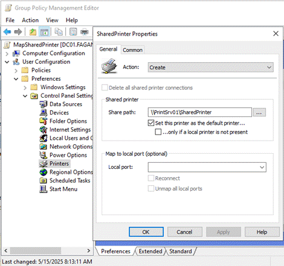

Learned about the different port types:
- **LPT1**: Parallel port — good for simple or virtual printers
- **FILE**: Sends output to a file — good for testing
- **COM**: Legacy serial ports — not used in modern setups
- **TS001**: Terminal Services ports — used in Remote Desktop scenarios

**I selected `LPT1`** since I didn’t need physical printing, just a shared, testable printer.

4. Named the printer **SharedPrinter**
5. Used the **Generic / Text Only** driver (required to complete setup without real hardware)
6. On the **Sharing tab**, enabled sharing with the share name: `SharedPrinter`
7. On the **Security tab**, removed `Everyone` and added the **AllEmployees** group to control access

### Mapping the Printer via Group Policy

1. Opened **Group Policy Management**
2. Created a new GPO in the `Headquarters` OU named `MapSharedPrinter`
3. Edited the GPO:
   - **User Configuration > Control Panel Settings > Printers**
   - Added a **new Shared Printer**
     - **Action:** Create  
     - **Share path:** `\\PrintSrv01\SharedPrinter`  
     - **Set as default printer**
   - On the **Common tab**, enabled **Item-level targeting**
     - Targeted the group: `AllEmployees`

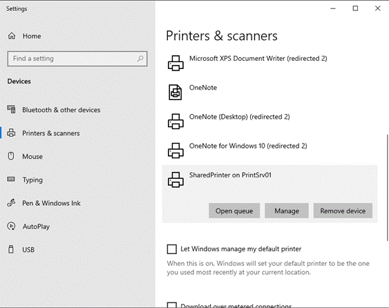

### Testing the Shared Printer

- Logged into the domain-joined client computer `DESKTOP-1` as `mtaylor`
- Went to **Printers & Scanners** in Settings and confirmed `SharedPrinter` was visible
- Opened **Command Prompt** and ran:
  ```bash
  gpresult /r

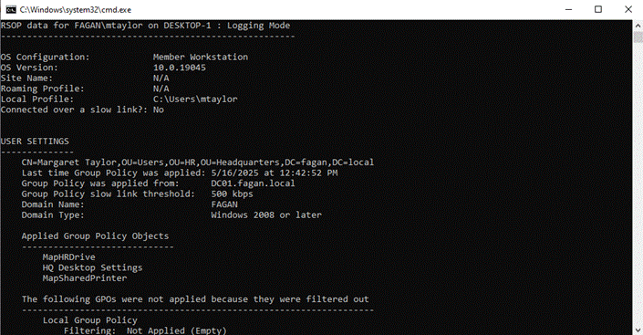

## Organizational Unit (OU) Structure

The OU structure in this Active Directory environment reflects the internal layout of Fagan Systems and follows best practices for administrative control and delegation.

This setup separates users and computers by department for easier Group Policy application and role-based access management. It also includes dedicated OUs for shared infrastructure and centralized group management.

### OU Hierarchy
fagan.local     
├── Headquarters      
│ ├── Finance      
│ │ ├── Computers      
│ │ └── Users      
│ ├── HR      
│ │ ├── Computers      
│ │ └── Users      
│ ├── IT       
│ │ ├── Computers       
│ │ └── Users       
│ └── Sales       
│ ├── Computers       
│ └── Users       
├── Workstations       
├── Servers       
└── Groups        

### Purpose of Each OU
- **Departmental OUs (Finance, HR, IT, Sales):**  
  Separated into `Computers` and `Users` to allow precise GPO targeting and management by department.

- **Workstations:**  
  Houses shared or non-department-specific computers (e.g., front desk or breakroom machines).

- **Servers:**  
  Contains infrastructure machines like `DC01` and `PrintSrv01`.

- **Groups:**  
  A centralized location for security groups used for access control and GPO targeting (e.g., `AllEmployees`, `HRConfidential`, `ITAdmins`).

### OU Structure – Visual Reference
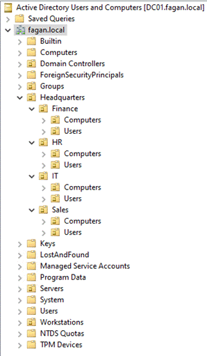

## Users
**Finance**  
`clee` — Chad Lee (Payroll)  
`afagan` — Ally Fagan (Accounting)  

**HR**  
`mtaylor` — Margaret Taylor (HR Manager)  
`jjackson` — Janet Jackson (HR Support)  

**IT**  
`esmith` — Emily Smith (Systems Administrator)  
`jabbott` — Jordan Abbott (IT Support)  

**Sales**  
`krighteous` — Karen Righteous (Sales Representative)  
`bmoney` — Bonnie Money (Sales Intern)


## Security Groups
**HRConfidential**  
- A **global security group** for HR staff.  
- Grants access to the HR department's confidential shared folder.  
- Helps restrict access to sensitive personnel data to only authorized HR members.

**ITAdmins**  
- A **global security group** for IT administrators and support staff.  
- Grants elevated permissions for managing systems and access to IT department shares and tools.  
- Used in Group Policy for admin-level configuration rights.

**AllEmployees**  
- A **global security group** that includes all domain users across departments.  
- Used for assigning organization-wide permissions, like shared printer access, default drives, and standard desktop settings via Group Policy.


## Access Control and Shared Folders

### HRConfidential Shared Folder     
**Shared Folder:** `\\DC01\HRConfidential`  
**Location:** `C:\HRConfidential` on DC01  
**Permissions:**
- Full control only for members of the `HRConfidential` security group
- Both **share** and **NTFS permissions** configured to restrict access
- Non-HR users are denied access, even when logged into domain-joined machines

**Access Testing:**     
✅ *`mtaylor` (HR) access granted*     

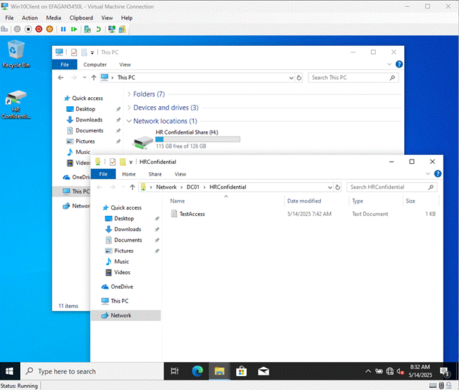     


❌ *`clee` (Finance) denied access:*   

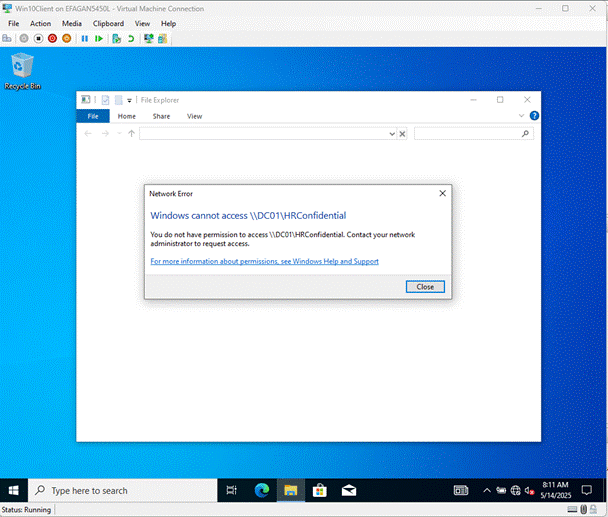     


### ITResources Shared Folder
**Shared Folder:** `\\DC01\ITResources`  
**Location:** `C:\ITResources$` (hidden folder using `$`)  
**Permissions:**
- Hidden from non-IT users
- Accessible only to `ITAdmins`, `Administrators`, and `SYSTEM`
- Inherited NTFS permissions removed, inheritance disabled
- Securely locked down following best practices

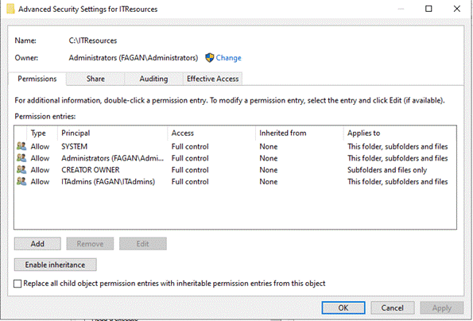

**Testing:**
❌ *`clee` (Finance) denied access:*

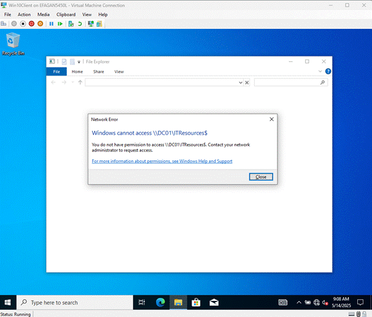

## Group Policy Objects (GPO)

### Map Network Drive for HRConfidential
A Group Policy Object named `Map HR Drive` was linked to the **HR Users OU**.

- **Item-level targeting** limits the drive to members of the `HRConfidential` group
- Ensures confidentiality and improves user experience
  
*Map `\\DC01\HRConfidential` to `H:` drive*:     
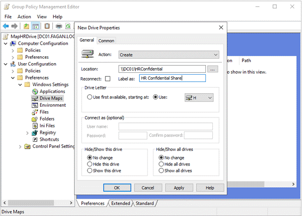       


### Set Desktop Wallpaper for All Users     
To standardize branding and restrict personalization:
- Created a folder on `DC01` to host the `.jpg` wallpaper
- GPO named `HQ Desktop Settings` created and linked to **Headquarters OU**
- Configured via:  
  `User Configuration > Policies > Administrative Templates > Desktop > Desktop Wallpaper`
- Set to use the network path of the image     

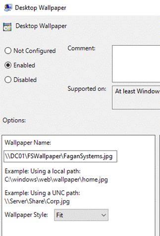     

- Also enabled:
  `Prevent changing desktop background` in  
  `Administrative Templates > Control Panel > Personalization`     

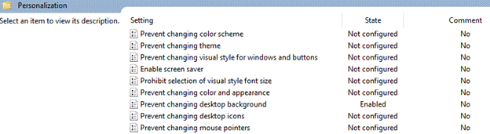

**Testing with user `mtaylor`:**     
✅ *Desktop wallpaper was applied:*     

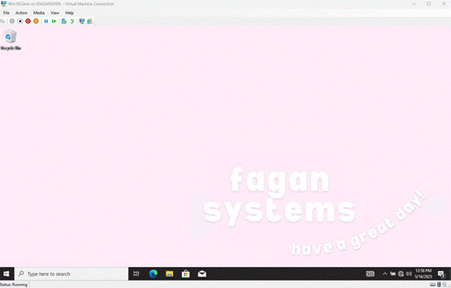

❌ *Unable to change the wallpaper manually:*     

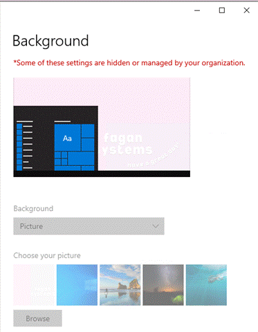     


### What is Group Policy?     
Group Policy allows centralized management of users, computers, and system settings in an Active Directory environment.

- Used to enforce security, deploy resources (like drives and printers), apply custom configurations, and automate administration.
- For example: Only HR can access `HRConfidential`, and all employees have the same default wallpaper without changing it manually.

GPOs help system administrators:
- Apply company-wide settings consistently
- Restrict access based on department or role
- Save time by automating repetitive tasks across the domain


### Viewing Applied GPOs on a Client
To see what policies are currently applied to a computer or user:

**Step 1:** Open Command Prompt  
- Press `Windows + R`, type `cmd`, press `Enter`

**Step 2:** Run:     
`gpresult /r`     

*To see full details, run Command Prompt as Administrator:*          
- `Windows + R`, type `cmd`, then press `Ctrl + Shift + Enter`       
This shows which GPOs are applied to the computer and the user (Resultant Set of Policy).    
