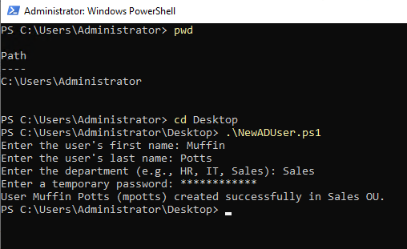
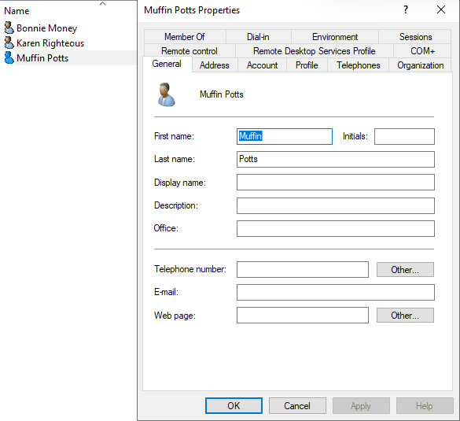
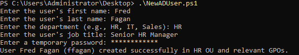
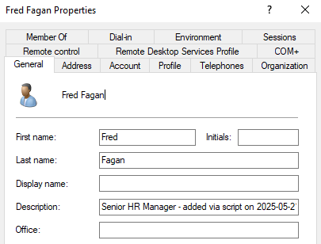
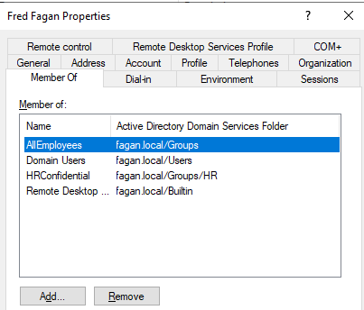
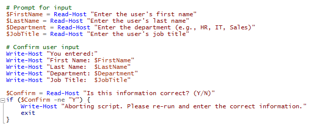
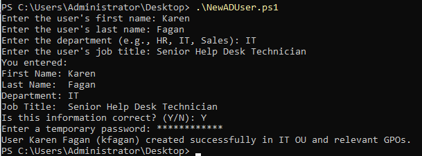
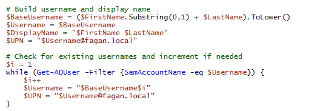

# PowerShell Automation for Active Directory User Management

This project showcases a PowerShell script developed as part of my Active Directory lab environment. It automates the creation of user accounts in a domain, including user prompts, validation, group assignments, and organizational unit (OU) placement. This script was designed to be both educational and practical, reflecting real-world administrative tasks.     


## Script File
📄 [View the NewADUser.ps1 script](./NewADUser.ps1)


## Purpose

To automate the user creation process in an Active Directory environment using PowerShell. The script:      
- Prompts for first name, last name, department, and job title
- Constructs a unique username
- Adds the user to Active Directory with appropriate attributes
- Assigns them to relevant security groups
- Ensures username uniqueness
- Provides a loop to create multiple users


## Features

- Interactive prompts for user info
- Confirmation of input before proceeding
- Username auto-generation (`first initial` + `last name`)
- Auto-increments username if it already exists (`esmith2`, `esmith3`, etc.)
- Dynamic OU path based on department
- Job title + timestamp stored in user description
- Automatic group assignment based on department
- Repeat loop to add multiple users in one session


## Sample Workflow

1. Run the script in PowerShell ISE or terminal as administrator
2. Enter the user's first name, last name, department, and job title
3. Confirm the info is correct
4. A username is generated, checked for duplicates, and modified if needed
5. The account is created and added to:      
   `AllEmployees`      
   `Remote Desktop Users`     
    if HR - `HRConfidential`      
    if IT - `ITAdmins`, `Administrators`      
6. The admin is prompted to add another user or exit


## Design Choices

### Description Field
- Format: `Job Title - added via script on YYYY-MM-DD`
- Purpose: Track when and why the user was created

### Username Check
Ensures no duplicate usernames exist.
```powershell
$BaseUsername = ($FirstName.Substring(0,1) + $LastName).ToLower()
$Username = $BaseUsername
$i = 1
while (Get-ADUser -Filter {SamAccountName -eq $Username}) {
    $i++
    $Username = "$BaseUsername$i"
}
```


## Notes and Processes

Ran the base script for the first time and I received an error because I was not in the correct directory. I changed my current directory to Desktop by using the command `cd`.     

       

Added my first user with my script, Muffin Potts `mpotts` in Sales. I went to check my AD Users and Computers to see if Muffin was added successfully.     

      

This is when I noticed that the Description would be empty on all my users if I didn't add something to my script. I decided to update the code to include a description - half automated with the date and "added via script" and half with the user's job title for clarity. I added this block of code:

```powershell
# Prompt for input
$JobTitle = Read-Host "Enter the user's job title"

# Build description
$Today = Get-Date -Format 'yyyy-MM-dd'
$Description = "$JobTitle - added via script on $Today"
```

I decided to try adding another user into HR so that I could see if the user was successfully added to the `HRConfidential` GPO.

     

User was successfully added to the `HRConfidential` GPO and the other general user GPOs, `AllEmployees` and `Remote Desktop Users`.

      


Next I wanted the script to ask the user if the information was correct, and if it wasn't, provide a way to exit without entering incorrect information to AD. Here's the bit of the script that I changed and an example on a new user:      

      


I made small improvements to my script to prevent case mismatching. I did this by adding `.ToUpper()`.     

I also wanted the script to ensure that each username it generates is unique. For example, if there were two users like Bill Smith and Bob Smith, both would initially generate the same username (e.g., `bsmith`). To handle this, I added a `while` loop that checks Active Directory for existing usernames and, if a conflict is found, automatically appends a number (e.g., `bsmith2`, `bsmith3`, etc.) until a unique username is created.     

     

I accidentally ended up assigning one of my `esmith` users as just the username of `2` because I didn't add the increment properly in the code, so I learned how to change the usernames in PowerShell: `Set-ADUser -Identity oldusername -SamAccountName newusername` and fixed `Eloise Smith`'s username to `esmith2`.     

The last thing I did was wrap my entire user-creation script in a `do {...} while` loop so that it keeps running until the admin says to stop. I added a question at the end to ask the admin if they wanted to add another user or if they wanted to quit.

```powershell
 # Ask if you want to create another

    $Repeat = (Read-Host "Would you like to add another user? (Y/N)").ToUpper()
```
