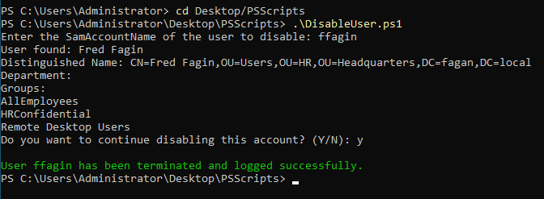
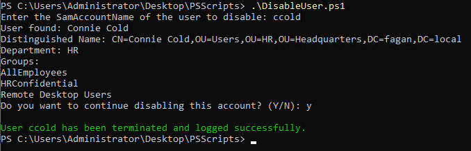

# PowerShell Automation: Disabling User Accounts in Active Directory

As an extension of my Active Directory lab, I developed a PowerShell script to automate the user termination process. This reflects a real-world IT offboarding workflow that ensures security, maintains clean directory structure, and provides audit logging.     


## Project Objectives

The script performs the following automated tasks:
1. Prompts the admin to select a user by username (SamAccountName)
2. Displays user info for confirmation (Display Name, Department, Groups)
3. Removes the user from all security groups
4. Disables the account
5. Moves the user to a dedicated `DisabledAccounts` OU
6. Updates the AD description with the termination date
7. Archives the user’s home directory (if applicable)
8. Logs the action and removed groups to a `.csv` file on the desktop


## OU and GPO Design

I created a dedicated `DisabledAccounts` Organizational Unit (OU) to house terminated accounts. This OU is isolated from normal user OUs and can optionally have Group Policy Objects (GPOs) applied for extra security.      

     


To add an additional layer of protection, I created a GPO called **Disabled Accounts Lockdown**, linked to the `DisabledAccounts` OU. It includes the following settings under:     

`Computer Configuration > Windows Settings > Security Settings > Local Policies > User Rights Assignment`     
- Deny log on locally
- Deny log on through Remote Desktop Services     

     

These settings were applied to the `Domain Users` group. Since the GPO is only linked to the `DisabledAccounts` OU, active users in other OUs remain unaffected.     


## Script Walkthrough and Testing

The script begins by prompting the administrator for a username, then retrieves and displays key user attributes (DisplayName, DistinguishedName, Department, Group Memberships) for confirmation.

Once confirmed, the script:
- Removes group memberships
- Disables the account
- Moves the user to `DisabledAccounts`
- Resets the password (in testing, it's a known value: `Disabled123!`)
- Updates the AD description to reflect the disable date
- Archives the user's home directory
- Logs all actions and removed groups to a `.csv` on the desktop

Here’s the optional production-ready password reset alternative:  

```powershell
# Generate random secured password
Add-Type -AssemblyName System.Web
$newPassword = [System.Web.Security.Membership]::GeneratePassword(12, 2)
Set-ADAccountPassword -Identity $user -Reset -NewPassword (ConvertTo-SecureString -AsPlainText $newPassword -Force)
```

For testing my script, I decided to test Chad Lee's account, `clee`. I received an error in the code, but it said that it had been run successfully:     

       


After investigating my Users and Computers menu, I saw that Chad Lee had been moved into the `DisabledAccounts` OU, but his description was not updated:     

     

The logging had also worked, and the TerminationLogs folder appeared on my desktop:     

     


The only thing that did not work was adding the description in Active Directory for the deleted user date. I made the same mistake in my previous script, where I didn't refresh the `$user` object after moving it to the `DisabledAccounts` OU. The program was trying to find Chad's old `DistinguishedName`, which does not exist anymore.     

I updated this part of the script:        

```powershell
# Move user to DisabledAccounts OU
$targetOU = "OU=DisabledAccounts,DC=fagan,DC=local"
Move-ADObject -Identity $user.DistinguishedName -TargetPath $targetOU

#Refresh user object after move
$user = Get-ADUser -Identity $username

# Update AD description with disable date
$date = Get-Date -Format "yyyy-MM-dd"
Set-ADUser -Identity $user -Description "Disabled account on $date"
```

I then tried the script again, this time with Fred Fagin (ffagin).         




The script was successful - Fred was moved to the `DisabledAccounts` OU, and his description was updated.


However, when I looked back at the logs, I noticed an error:         

      


The logs stated that Fred was removed from 0 groups, which means I needed to update the script to count the groups _before_ removing the user from them. And I also decided that I wanted to change the script to not just count the groups, but to list them in the CSV log as well.     

So, I replaced this part of the code:     

```powershell
# Remove from all groups
$user.MemberOf | ForEach-Object {
    Remove-ADGroupMember -Identity $_ -Members $user -Confirm:$false
}
```


With this:     

```powershell
# Get original group names before removal
$originalGroupDNs = $user.MemberOf
$removedGroups = @()

foreach ($groupDN in $originalGroupDNs) {
    $groupName = (Get-ADGroup $groupDN).Name
    Remove-ADGroupMember -Identity $groupName -Members $user -Confirm:$false
    $removedGroups += $groupName
}
```


I tried the code again with a new user, Connie Cold (`ccold`).     

      


I checked the logs to see if she was logged correctly, and she was!     

     
