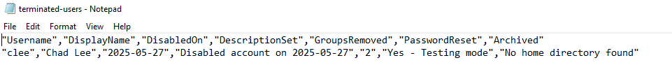

# PowerShell Automation: Disabling User Accounts in Active Directory

As an extension of my Active Directory lab, I developed a PowerShell script to automate the user termination process. This reflects a real-world IT offboarding workflow that ensures security, maintains clean directory structure, and provides audit logging.     


## Script File
📄[View the DisableUser.ps1 script](./DisableUser.ps1)     


## Project Objectives

The script performs the following automated tasks:
1. Prompts the admin to select a user by username (SamAccountName)
2. Displays user info for confirmation (Display Name, Department, Groups)
3. Removes the user from all security groups
4. Disables the account
5. Moves the user to a dedicated `DisabledAccounts` OU
6. Updates the AD description with the termination date
7. Archives the user’s home directory (if applicable)
8. Logs the action and removed groups to a `.csv` file on the desktop


## OU and GPO Design

I created a dedicated `DisabledAccounts` Organizational Unit (OU) to house terminated accounts. This OU is isolated from normal user OUs and can optionally have Group Policy Objects (GPOs) applied for extra security.      

     


To add an additional layer of protection, I created a GPO called **Disabled Accounts Lockdown**, linked to the `DisabledAccounts` OU. It includes the following settings under:     

`Computer Configuration > Windows Settings > Security Settings > Local Policies > User Rights Assignment`     
- Deny log on locally
- Deny log on through Remote Desktop Services     

     

These settings were applied to the `Domain Users` group. Since the GPO is only linked to the `DisabledAccounts` OU, active users in other OUs remain unaffected.     


## Script Walkthrough and Testing

The script begins by prompting the administrator for a username, then retrieves and displays key user attributes (DisplayName, DistinguishedName, Department, Group Memberships) for confirmation.     

Once confirmed, the script:     
- Removes group memberships
- Disables the account
- Moves the user to `DisabledAccounts`
- Resets the password (in testing, it's a known value: `Disabled123!`)
- Updates the AD description to reflect the disable date
- Archives the user's home directory
- Logs all actions and removed groups to a `.csv` on the desktop

Here’s the optional production-ready password reset alternative:       

```powershell
# Generate random secured password
Add-Type -AssemblyName System.Web
$newPassword = [System.Web.Security.Membership]::GeneratePassword(12, 2)
Set-ADAccountPassword -Identity $user -Reset -NewPassword (ConvertTo-SecureString -AsPlainText $newPassword -Force)
```


## Script Testing Results

**First Test:** Chad Lee (`clee`)     

- Account was moved to the correct OU     

       


- Log entry was created successfully

     


**Issue:** AD description was not updated     

     


**Cause:** I forgot to refresh the `$user` object after moving it to a new OU. The script was still referencing the user’s _old DistinguishedName_.         


**Fix:**     

```powershell
#Refresh user object after move
$user = Get-ADUser -Identity $username

# Update AD description with disable date
$date = Get-Date -Format "yyyy-MM-dd"
Set-ADUser -Identity $user -Description "Disabled account on $date"
```


**Second Test:** Fred Fagin (`ffagin`)      

- Description was correctly updated after refreshing the user object     

     


**Issue:** The log reported that 0 groups were removed.     

      


**Cause:** I was counting `$user.MemberOf.Count` _after_ the groups had already been removed.     

**Final Improvement: Logging Group Names**          

To make the logging more accurate and informative, I changed the script to store the original group names _before_ removal and list them in the CSV:     

**Before:**     
```powershell
# Remove from all groups
$user.MemberOf | ForEach-Object {
    Remove-ADGroupMember -Identity $_ -Members $user -Confirm:$false
}
```     
  
**After:**     
```powershell
# Get original group names before removal
$originalGroupDNs = $user.MemberOf
$removedGroups = @()

foreach ($groupDN in $originalGroupDNs) {
    $groupName = (Get-ADGroup $groupDN).Name
    Remove-ADGroupMember -Identity $groupName -Members $user -Confirm:$false
    $removedGroups += $groupName
}
```     


**Final Test:** Connie Cold (`ccold`)     

Everything worked successfully:     
- Group names were listed in the log
- AD Description was updated
- Home directory archive logic executed
- Log file confirmed successful operation     

        


## Summary 

This project demonstrates how PowerShell can be used to automate secure, auditable user termination processes in Active Directory. It reflects real-world IT and sysadmin practices, inlcuding:     
- Least priviledge enforcement
- OU-based access segregation
- Secure offboarding
- Event logging
