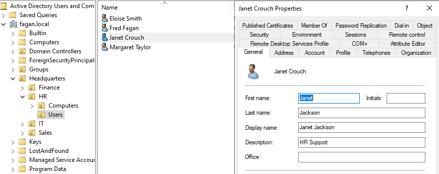

# Active Directory User Rename Script in PowerShell

This PowerShell script automates the process of renaming Active Directory user accounts in response to name changes — such as after marriage or divorce. It streamlines the update of key identity attributes including the user's full name, display name, logon name (sAMAccountName), and User Principal Name (UPN).      

This tool is designed to reflect real-world IT support tasks, where consistent and accurate user records are essential for both user experience and security.   


## Script File
📄[View the final RenameADUser.ps1 file](./RenameADUser.ps1)     


## Features

- Prompts for the user’s current username and new first and last names.
- Updates the `Name`, `DisplayName`, `GivenName`, and `Surname` fields in Active Directory.
- Renames the `SamAccountName` and `UserPrincipalName` to match the new name.
- Automatically generates the new username based on the updated first and last names.
- Logs success or error messages for administrator awareness.


## Skills Demonstrated

- PowerShell scripting
- Active Directory User Management
- Identity and Access Management (IAM)
- Realistic IT support automation
- Error handling and validation


## Notes and Processes

Here's the base script that I wrote just to see if there were any bugs:      
```powershell
# RenameADUser.ps1

# Load the Active Directory Module
Import-Module ActiveDirectory

# Function to prompt for user input and return a valid AD user
function Get-ValidUser {
    while ($true) {
        $CurrentUsername = Read-Host "Enter the current username (sAMAccountName) of the user"
        $user = Get-ADUser -Identity $CurrentUsername -Properties DisplayName, SamAccountName, UserPrincipalName, GivenName, Surname -ErrorAction SilentlyContinue

        if ($user) {
            return $user
        } else {
            Write-Host "User '$CurrentUsername' not found." -ForegroundColor Red
            $tryAgain = Read-Host "Would you like to try a different username? (Y/N)"
            if ($tryAgain -notin @("Y", "y")) {
                Write-Host "Exiting script." -ForegroundColor Yellow
                exit
            }
        }
    }
}

# Prompt for a valid user
$user = Get-ValidUser

# Get new name info
$NewFirstName = Read-Host "Enter user's new first name"
$NewLastName = Read-Host "Enter user's new last name"

# Build new attributes
$newDisplayName = "$NewFirstName $NewLastName"
$newSamAccountName = ($NewFirstName.Substring(0,1) + $NewLastName).ToLower()
$newUserPrincipalName = "$newSamAccountName@fagan.local"

$oldSamAccountName = $user.SamAccountName

try {
    Rename-ADObject -Identity $user.DistinguishedName -NewName $newDisplayName

    Set-ADUser -Identity $user.DistinguishedName `
        -GivenName $NewFirstName `
        -Surname $NewLastName `
        -DisplayName $newDisplayName `
        -SamAccountName $newSamAccountName `
        -UserPrincipalName $newUserPrincipalName

    Write-Host "`n User '$oldSamAccountName' renamed successfully to '$newSamAccountName'"
    Write-Host "  New Display Name: $newDisplayName"
    Write-Host "  New UPN: $newUserPrincipalName"
} catch {
    Write-Host "Error: $_" -ForegroundColor Red
}
```

I attempted to change user `jjackson`'s name to Janet Crouch. When I ran the script it appeared to be working, and in Active Directory Users and Computers, her common name in the HR group was showing up as `Janet Crouch`, but when I navigated to `Janet Crouch Properties`, it still showed that her name was `Janet Jackson`.      

      

To confirm that Janet's name was still incorrect in the system, I ran the following script to check if there was a username matching `jcrouch`. This would also tell me if the script didn't work because there was already a username `jcrouch` in the system.      


```powershell
Get-ADUser -Filter { SamAccountName -eq "jcrouch" } | Select Name, SamAccountName
```

Nothing was returned, so this told me my code was incorrect.       

I rewrote the script so that in each step it would tell me what failed. When I retried the script trying to change `esmith`'s name to Emily Gregory, it returned some hints as to why it was not working:       

     


The script was only changing the `DisplayName` because it works sequentially, and PowerShell does not automatically refresh objects. So when the program was trying to change Emily Smith to Emily Gregory:     

```powershell
try {
    Rename-ADObject -Identity $user.DistinguishedName -NewName $newDisplayName

    Set-ADUser -Identity $user.DistinguishedName `
        -GivenName $NewFirstName `
        -Surname $NewLastName `
        -DisplayName $newDisplayName `
        -SamAccountName $newSamAccountName `
        -UserPrincipalName $newUserPrincipalName
```

It was trying to update an object using the old `DistinguishedName`: `CN=Emily Smith,OU=Employees,DC=fagan,DC=local` which no longer existed. 

I solved this by refreshing the `$user` object after changing the display name. Here's a sample:      

```powershell
 # Rename AD object
    Rename-ADObject -Identity $user.DistinguishedName -NewName $newDisplayName
```
This is where I rename the Active Directory object - where I change the `Common Name (CN)` part of the `Distinguished Name`. In Active Directory, changing the `CN` changes the location of the object in the tree. It's like changing the path name in a filesystem. The `Distinguished Name` is the like the file path in a filesystem. So I had to make sure that the script is calling the right DistinguishedName, or else it won't be able to update the rest of the attributes. This is why there was an error.

```powershell
    # Refresh user object with updated DistinguishedName
    $user = Get-ADUser -Identity $oldSamAccountName -Properties DisplayName, SamAccountName, UserPrincipalName, GivenName, Surname
```
This part grabs the fresh version of the user from AD using their old username (oldSamAccountName), so that everything is ready to be updated.     

```powershell
    # Update user attributes
    Set-ADUser -Identity $user.DistinguishedName `
        -GivenName $NewFirstName `
        -Surname $NewLastName `
        -DisplayName $newDisplayName `
        -SamAccountName $newSamAccountName `
        -UserPrincipalName $newUserPrincipalName
```
This is where everything is updated.     

I ran the debugged version of the code without any errors and successfully changed the name of Janet Jackson to Janet Crouch!      

      

This project is still in progress.
