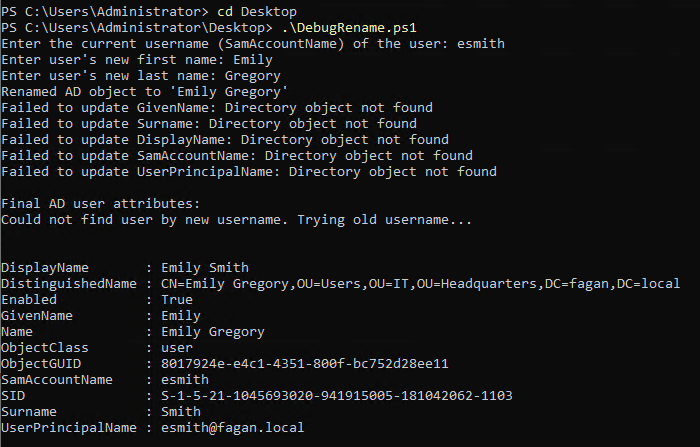
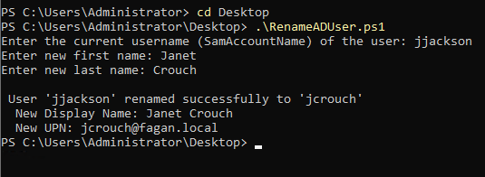
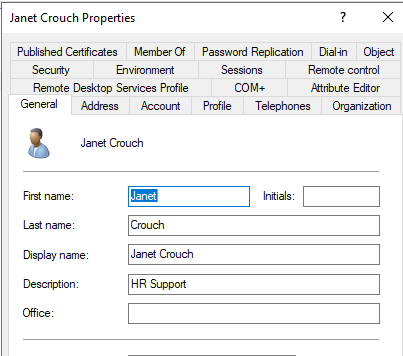

# Active Directory User Rename Script in PowerShell

This PowerShell script automates the process of renaming Active Directory user accounts in response to name changes — such as after marriage or divorce. It streamlines the update of key identity attributes including the user's full name, display name, logon name (sAMAccountName), and User Principal Name (UPN).      

This tool is designed to reflect real-world IT support tasks, where consistent and accurate user records are essential for both user experience and security.   


## Script File
📄[View the final RenameADUser.ps1 file](./RenameADUser.ps1)     


## Features

- Prompts for the user’s current username and new first and last names.
- Updates the `Name`, `DisplayName`, `GivenName`, and `Surname` fields in Active Directory.
- Renames the `SamAccountName` and `UserPrincipalName` to match the new name.
- Automatically generates the new username based on the updated first and last names.
- Logs success or error messages for administrator awareness.


## Skills Demonstrated

- PowerShell scripting
- Active Directory User Management
- Identity and Access Management (IAM)
- Realistic IT support automation
- Error handling and validation


## Notes and Processes

This PowerShell script was developed to automate renaming a user in Active Directory. The goal was to change a user's name (e.g., due to marriage or legal name change) and update the relevant attributes such as `DisplayName`, `SamAccountName`, and `UserPrincipalName`, all while ensuring that existing usernames don't conflict.     


### Initial Script

Below is the base script I wrote to test for any issues:      
```powershell
# RenameADUser.ps1

# Load the Active Directory Module
Import-Module ActiveDirectory

# Function to prompt for user input and return a valid AD user
function Get-ValidUser {
    while ($true) {
        $CurrentUsername = Read-Host "Enter the current username (sAMAccountName) of the user"
        $user = Get-ADUser -Identity $CurrentUsername -Properties DisplayName, SamAccountName, UserPrincipalName, GivenName, Surname -ErrorAction SilentlyContinue

        if ($user) {
            return $user
        } else {
            Write-Host "User '$CurrentUsername' not found." -ForegroundColor Red
            $tryAgain = Read-Host "Would you like to try a different username? (Y/N)"
            if ($tryAgain -notin @("Y", "y")) {
                Write-Host "Exiting script." -ForegroundColor Yellow
                exit
            }
        }
    }
}

# Prompt for a valid user
$user = Get-ValidUser

# Get new name info
$NewFirstName = Read-Host "Enter user's new first name"
$NewLastName = Read-Host "Enter user's new last name"

# Build new attributes
$newDisplayName = "$NewFirstName $NewLastName"
$newSamAccountName = ($NewFirstName.Substring(0,1) + $NewLastName).ToLower()
$newUserPrincipalName = "$newSamAccountName@fagan.local"

$oldSamAccountName = $user.SamAccountName

try {
    Rename-ADObject -Identity $user.DistinguishedName -NewName $newDisplayName

    Set-ADUser -Identity $user.DistinguishedName `
        -GivenName $NewFirstName `
        -Surname $NewLastName `
        -DisplayName $newDisplayName `
        -SamAccountName $newSamAccountName `
        -UserPrincipalName $newUserPrincipalName

    Write-Host "`n User '$oldSamAccountName' renamed successfully to '$newSamAccountName'"
    Write-Host "  New Display Name: $newDisplayName"
    Write-Host "  New UPN: $newUserPrincipalName"
} catch {
    Write-Host "Error: $_" -ForegroundColor Red
}
```


### Troubleshooring and Debugging

When testing the script with the user `jjackson`, I attempted to rename her to **Janet Crouch**. While the Display Name in Active Directory appeared to update, the `Properties` window still listed her name as **Janet Jackson**.    

      


To determine whether the script had successfully created a new user object or if a conflict existed, I used:       

```powershell
Get-ADUser -Filter { SamAccountName -eq "jcrouch" } | Select Name, SamAccountName
```     

The query returned nothing—indicating the script didn’t update the `SamAccountName` or `UPN` as expected.

I enhanced the script with additional feedback and error-checking. When running it again for `esmith` (trying to rename her to Emily Gregory), I received errors pointing to the cause:       

     


The problem was due to PowerShell using a stale `DistinguishedName`. After renaming the AD object (which changes the `CN` portion of the `DistinguishedName`), the script attempted to update the user using the _old_ path:     

```powershell
try {
    Rename-ADObject -Identity $user.DistinguishedName -NewName $newDisplayName
```     

Since the `CN` changed from `Emily Smith` to `Emily Gregory`, the original `DistinguishedName` was no longer valid. This is similar to changing the path of a file—once it moves, the old path no longer works.     


### Solution

To fix the issue, I refreshed the `$user` object after renaming:        

```powershell
    # Refresh user object with updated DistinguishedName
    $user = Get-ADUser -Identity $oldSamAccountName -Properties DisplayName, SamAccountName, UserPrincipalName, GivenName, Surname
```     
This ensured all updates used the new, correct `DistinguishedName`.      

Then I proceeded with the attribute updates:      

```powershell
    # Update user attributes
    Set-ADUser -Identity $user.DistinguishedName `
        -GivenName $NewFirstName `
        -Surname $NewLastName `
        -DisplayName $newDisplayName `
        -SamAccountName $newSamAccountName `
        -UserPrincipalName $newUserPrincipalName
```       

After this fix, I successfully renamed Janet Jackson to Janet Crouch without any errors.          

      
         
